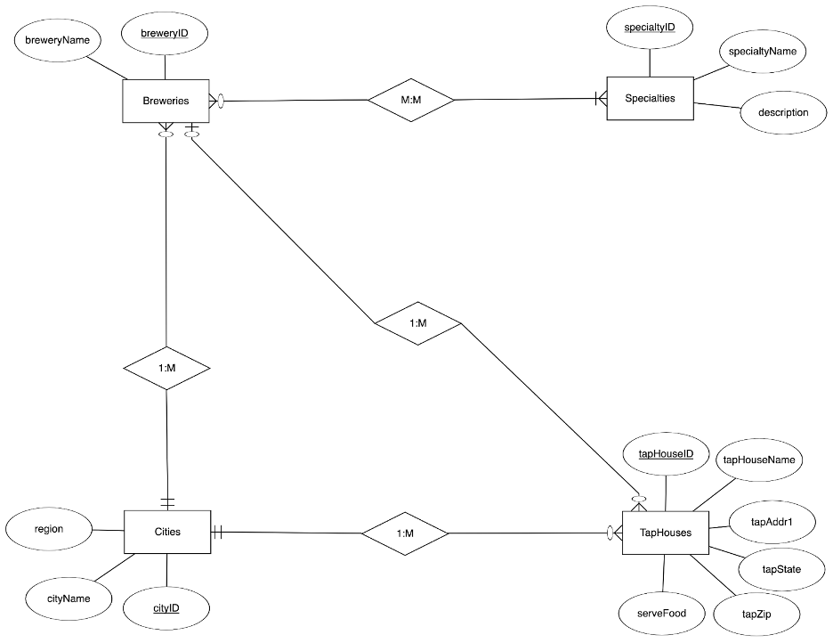

# Brew Oregon

_This project was developed for Oregon State University's Introduction to Databases (CS340) class in partnership with Michael Allcock (https://github.com/MichaelAllcock)_

Project is hosted on the Oregon State University (OSU) servers at: http://flip2.engr.oregonstate.edu:3107/

NOTE: To connect to the online version of the project you must have OSU VPN access. Otherwise please see "ProjectSummaryReport.pdf" for an overview of the project, including screenshots of the user interface. Or view the project files individually in the "ProjectFiles" folder.

---

## Included File

-   ProjectSummaryReport.pdf: A report summarizing the project. Screenshots of the web UI show interface used to Create, Read, Update, and Delete entries from each SQL table.
-   DDL.sql: Summary of all SQL queries used to create each table and foreign keys (Create).
-   DML.sql: Summary of all SQL queries used to view and manipulate entries in each table(Read, Update, and Delete)
-   ProjectFiles: All files used to create and host project

---

## Database Structure

### Entity-Relationship Diagram

### Schema

Schema Key: **Primary Keys** = Bold & Underlined; **Foreign Keys** = (FK); **Optional Attributes** = (O)
